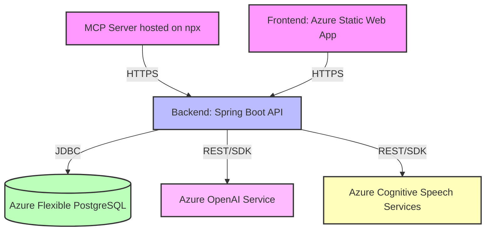
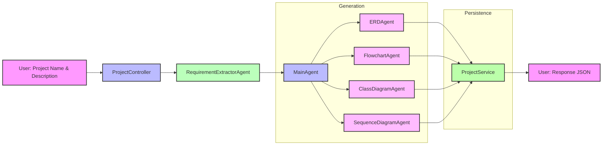
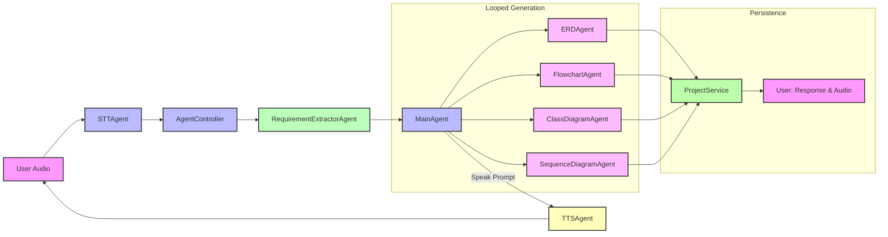
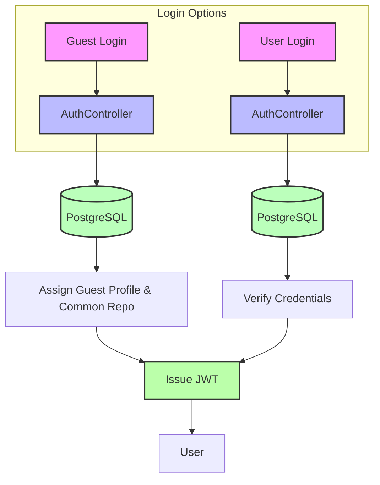
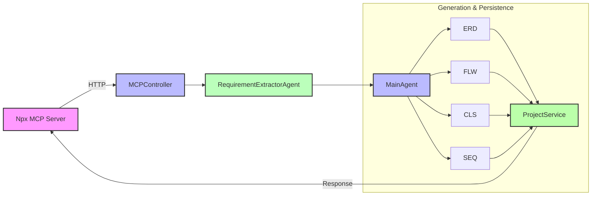

# Marchina Backend


Marchina Backend is a Spring Boot application that powers the Marchina AI Agents and Marchina Voice. It provides RESTful APIs for project and diagram management, and coordinates multiple AI agents (STT, Requirement Extraction, Diagram Generators, TTS) to build and validate technical diagrams. The service uses Microsoft Azure Container Apps for hosting, Azure Flexible PostgreSQL for the database, and Azure OpenAI & Cognitive Services for AI capabilities.


Quick Links to Marchina Repositories
- [Marchina Frontend](https://github.com/Paul-M-Kallarackal/marchina-frontend)
- [Marchina MCP Server](https://github.com/Paul-M-Kallarackal/marchina-mcp)

## Table of Contents

- [Architecture Overview](#architecture-overview)
- [Deployment Flow](#deployment-flow)
- [Agent Orchestration](#agent-orchestration)
- [Agent Flows](#agent-flows)
- [Project Structure](#project-structure)
- [Getting Started](#getting-started)
- [Environment Variables](#environment-variables)

## Architecture Overview

This diagram illustrates how the frontend and backend interact with external services:

### Deployment Flow


## Agent Orchestration and Flows

### 1. Text-based Project Creation Flow


### 2. Voice-based Project Creation Flow


### 3. Login Flow


### 4. MCP Server Flow


## Project Structure

```bash
marchina-backend/
├── src/
│   ├── main/
│   │   ├── java/com/marchina/
│   │   │   ├── agent/                # AI Agent implementations (STT, TTS, Main, ERD, etc.)
│   │   │   ├── controller/           # REST controllers (ProjectController, AgentController, etc.)
│   │   │   ├── model/                # Request & response DTOs
│   │   │   └── MarchinaApplication.java  # Spring Boot entry point
│   │   └── resources/
│   │       ├── application.properties  # Configuration
│   │       └── templates/              # Freemarker/Thymeleaf views (if any)
│   └── test/                         # Unit and integration tests
├── .github/workflows/                # GitHub Actions workflows for CI/CD
├── .azure/                           # Azure Resource Manager templates & settings
├── Dockerfile                        # Docker build for container
├── docker-compose.yml                # Local multi-container setup
├── pom.xml                           # Maven pom definition
└── mvnw, mvnw.cmd, .mvn/             # Maven wrapper
```

## Getting Started

### Prerequisites

- Java 17 or higher
- Maven 3.6 or higher
- Docker (for containerized deployment)
- Azure CLI (for Azure Container Apps)

### Local Development

1. Clone the repository:
   ```bash
   git clone https://github.com/<YOUR_GITHUB_ORG>/marchina-backend.git
   cd marchina-backend
   ```
2. Configure environment variables as below.
3. Build and run with Docker:
   ```bash
   mvn clean package -DskipTests
   docker-compose up --build
   ```
4. API will be available at `http://localhost:8080/api`

## Environment Variables

| Name                       | Description                                  |
|----------------------------|----------------------------------------------|
| SERVER_PORT                | Port for the Spring Boot application         |
| DB_URL                     | JDBC URL for PostgreSQL                      |
| DB_USERNAME                | Database username                            |
| DB_PASSWORD                | Database password                            |
| AZURE_OPENAI_KEY           | Azure OpenAI API key                         |
| AZURE_OPENAI_ENDPOINT      | Azure OpenAI endpoint URL                    |
| AZURE_SPEECH_KEY           | Azure Cognitive Speech key                   |
| AZURE_SPEECH_REGION        | Azure Cognitive Speech region                |

Set these in a `.env` file or environment prior to startup.

